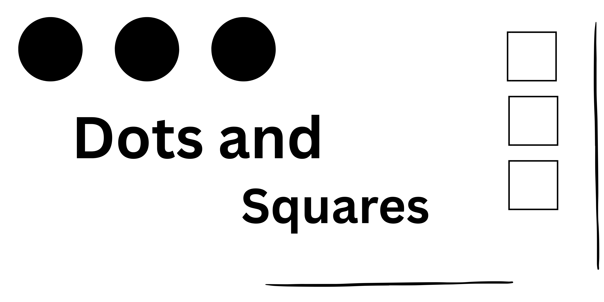

# Dots and Squares!

 Dots and Squares is a simple turn-based pencil-and-paper game where the goal is to claim more squares than your opponent by drawing lines between dots.

Game Link: [PLAY HERE](https://lonerrasta143.github.io/Dots-and-Square-Game/)

# How to play:

1. Players take turns.
2. On your turn, draw one line connecting two adjacent dots by clicking between the two dots. (horizontally or vertically).
3. Completing a square:
    -If your line completes the fourth side of a square, you claim that square.
    -You get another turn immediately.

4. Game continues until all possible squares are claimed.
5. Whoever has the most squares WIN!

>*FunFact: I used to play Dots amd square with my sister in church with paper and pen when I was younger*.

# How to score:

**Be the last line to complete a 4 dot square**

### Attributions:
- Picture of How To Play is from img.itch.zone
- Picture of my sister and I (facebook)

### Technologies Used: 
- Css
- JS
- HTML
- [dirtyMarkup](https://www.10bestdesign.com/dirtymarkup/)

### Helpful mdn used:
- getElementById() method
- createElement() method
- classList property
- addEventListener() method 
- CSS: Top & Left
- CSS: border-radius 
- Template literals (Template strings)
- Arrays

## Next steps?
- Make it online/mobile
- Make board dots count adjustable (add more dots)
- Make it so that box auto fill with inputted (chosen)initial or color.
- Change the background to be an image (paper)
- ~~Add sound for when the winner is selected~~
