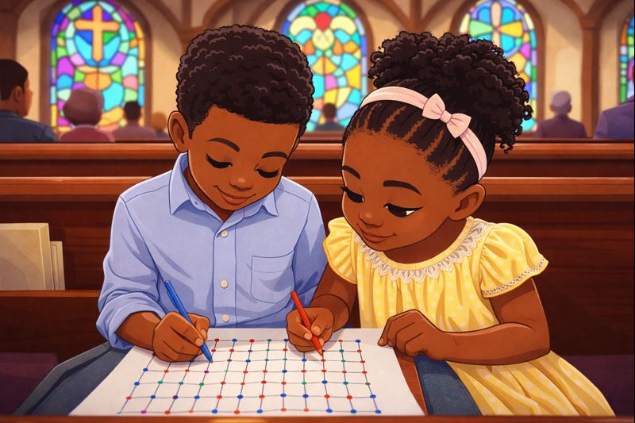

# Dots and Squares
 Dots and Squares is a simple turn-based pencil-and-paper game where the goal is to claim more squares than your opponent by drawing lines between dots.

Game Link: (Coming soon)

# How to play:

1. Players take turns.
2. On your turn, draw one line connecting two adjacent dots (horizontally or vertically).
3. Completing a square:
    -If your line completes the fourth side of a square, you claim that square.
    -You get another turn immediately.

4. Game continues until all possible squares are claimed.
5. Whoever has the most squares WIN!

>*FunFact: I used to play Dots amd square with my sister in church with paper and pen when I was younger*.

# How to score:

**Be the last line to complete a 4 dot square**

### Attributions:
- /home/willi/code/projects/Dots-and-Square-Game/assets/images/Twokidsplayingdotsandsquareatchurch.jpeg
- Canva.com Generate image of "Kids playing dots and squares in church"
### Technologies Used: 
- Css
- JS
- HTML

## Next steps?
- Make it online/mobile